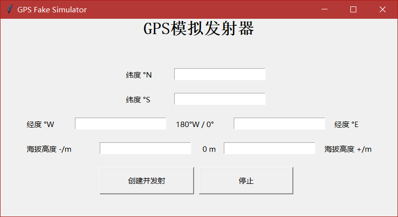
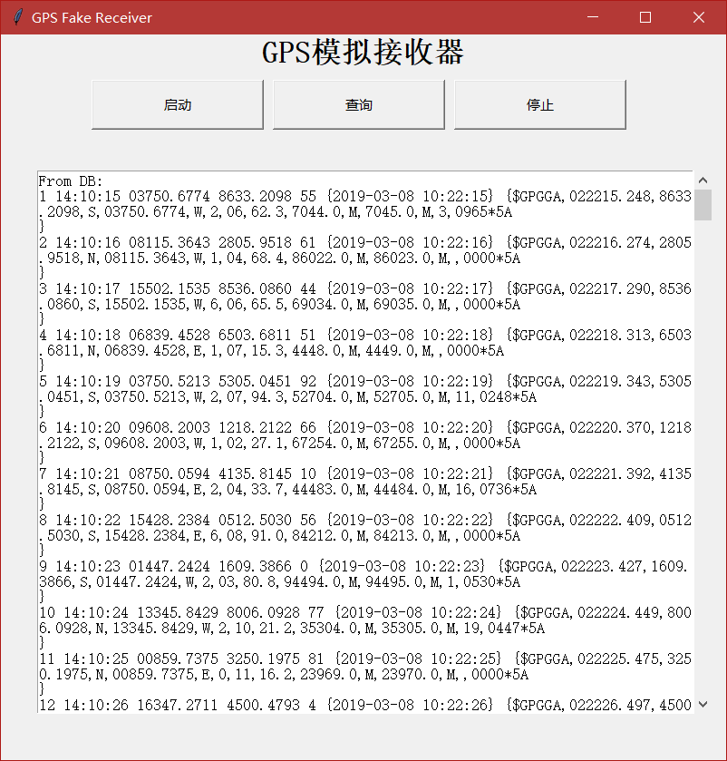

# Fake_GPS

[English Version](#english)

## Python GPGGA GPS 信号模拟 & 接收 & 存储 (单链表&SQLite3)

### 1. [客户端](https://github.com/joey66666/Fake_GPS/blob/master/client.py)

1. 创建多线程，生成基于当前UTC时间，随机经纬度高度等信息的GPGGA GPS信号
2. 发送到服务端
3. 存入数据库

>格式：\$GPGGA,<1>,<2>,<3>,<4>,<5>,<6>,<7>,<8>,<9>,M,<10>,M,<11>,<12>\*hh\<CR>\<LF>
>
>举例：\$GPGGA,115542.000,3155.3446,N,11852.4283,E,1,03,4.4,32.6,M,5.4,M,,0000*5A
>
><1> UTC 时间，hhmmss（时分秒）格式
>
><2> 纬度ddmm.mmmm（度分）格式（前面的0 也将被传输）
>
><3> 纬度半球N（北半球）或S（南半球）
>
><4> 经度dddmm.mmmm（度分）格式（前面的0 也将被传输）
>
><5> 经度半球E（东经）或W（西经）
>
><6> GPS 状态：0=未定位，1=非差分定位，2=差分定位，6=正在估算
>
><7>正在使用解算位置的卫星数量（00-12）（前面的0 也将被传输）
>
><8> HDOP水平精度因子（0.5-99.9）
>
><9>海拔高度（-9999.9-99999.9）
>
><10> 地球椭球面相对大地水准面的高度
>
><11> 差分时间（从最近一次接收到差分信号开始的秒数，如果不是差分定位将为空）
>
><12> 差分站ID 号0000-1023（前面的0 也将被传输，如果不是差分定位将为空）

[GPGGA定义](https://blog.csdn.net/qq_24536171/article/details/72742908)

### 2. [服务端](https://github.com/joey66666/Fake_GPS/blob/master/server.py)

1. 接收GPGGA信号，解析
2. 插入单链表并存入数据库
3. 查询数据库并显示

依赖：

- sqlite3
- socketserver
- threading
- tkinter

### 3. 数据库

##### gpsDB - 客户端发送数据库

| Name | Type    | Description |
| ---- | ------- | ----------- |
| ID   | integer | 自增主键    |
| GPS  | TEXT    | GPGGA 信号  |
| time | TEXT    | 发送时间    |

##### gpsDB2 - 服务端接收数据库

| Name        | Type    | Description             |
| ----------- | ------- | ----------------------- |
| ID          | integer | 自增主键                |
| rec_utcTime | TEXT    | 解析出的UTC 时间        |
| longitude   | TEXT    | 解析出经度              |
| latitude    | TEXT    | 解析出纬度              |
| velocity    | TEXT    | random.randrange(0,100) |
| time        | TEXT    | 当前时间                |
| origin      | TEXT    | 信号全文                |

客户端:

服务端:

## Python Simulator of GPGGA Message Client & Server

### 1. [Client](https://github.com/joey66666/Fake_GPS/blob/master/client.py)

1. Create multithread, generate GPGGA GPS signal based on current UTC time and random location.
2. Send to Server & Insert into SQLite3 (gpsDB)

>Format：\$GPGGA,<1>,<2>,<3>,<4>,<5>,<6>,<7>,<8>,<9>,M,<10>,M,<11>,<12>\*hh\<CR>\<LF>
>
>Example：\$GPGGA,115542.000,3155.3446,N,11852.4283,E,1,03,4.4,32.6,M,5.4,M,,0000*5A
>
><1> UTC time, hhmmss
>
><2> Laittude, ddmm.mmmm
>
><3> Latitude Hemisphere, N or S
>
><4> Longitude, dddmm.mmmm
>
><5> Longitude Hemisphere, E or W
>
><6> GPS Status：0=Not positioned, 1=Non-differential positioning, 2=Differential positioning, 6=Positioning
>
><7>Satellite number, 00-12
>
><8> HDOP, 0.5-99.9
>
><9>Altitude, -9999.9-99999.9
>
><10> Undulation - the relationship between the geoid and the WGS84 ellipsoid
>
><11> Differential time
>
><12> Differential base station ID

[GPGGA format definition](https://docs.novatel.com/oem7/Content/Logs/GPGGA.htm)

### 2. [Server](https://github.com/joey66666/Fake_GPS/blob/master/server.py)

1. Receive GPGGA signal and parse, extract latitude, longitude, UTC time
2. Append to singlelinklist & Insert into SQLite3 (gpsDB2)
3. Select * from DB & display on GUI

### 3. Database

##### gpsDB - Client sent signal 

| Name | Type    | Description        |
| ---- | ------- | ------------------ |
| ID   | integer | Auto Increment Key |
| GPS  | TEXT    | sent GPGGA signal  |
| time | TEXT    | sent local time    |

##### gpsDB2 - Server received signal 

| Name        | Type    | Description                    |
| ----------- | ------- | ------------------------------ |
| ID          | integer | Auto Increment Key             |
| rec_utcTime | TEXT    | UTC time from received signal  |
| longitude   | TEXT    | longitude from received signal |
| latitude    | TEXT    | latitude from received signal  |
| velocity    | TEXT    | random.randrange(0,100)        |
| time        | TEXT    | localtime                      |
| origin      | TEXT    | received origin signal         |

Dependencies：

- sqlite3
- socketserver
- threading
- tkinter

